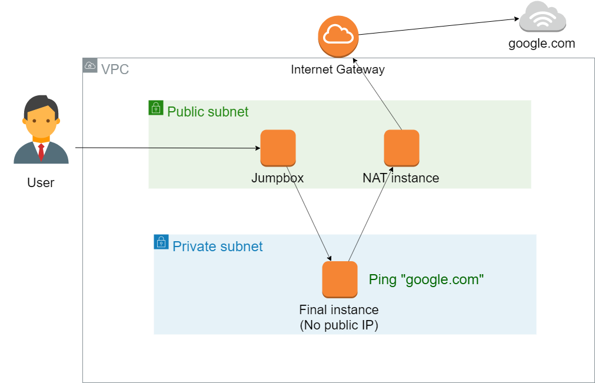
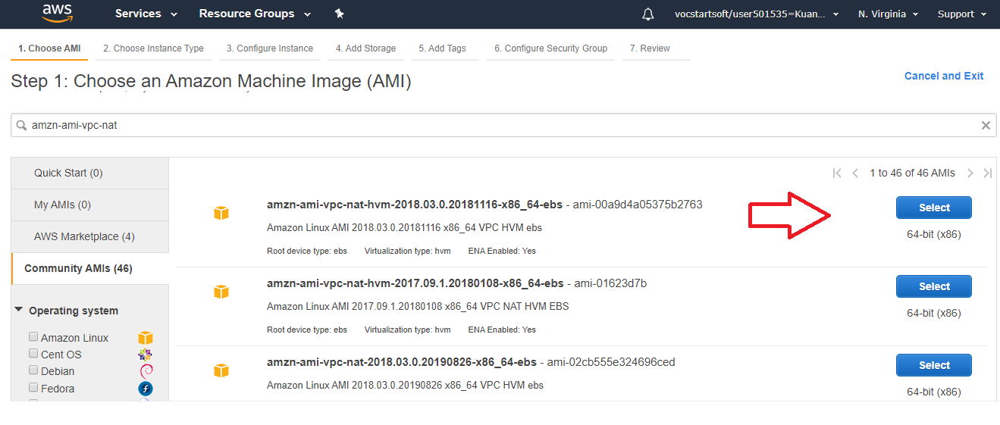
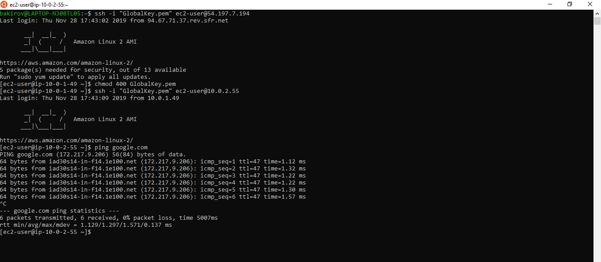

# AWS-Jumpbox Install
## **Aim:**
> From "Jumpbox" *(aka Bastion host)* access to "Final instance" which is located in private subnet and ping "google.com".

### Below is the architecture of Jumpbox:

## **Defining Services:**
|    Services     | Given name         | IPv4 |
|      ---       |  ---         |  --- |
| `VPC`          | GlobalVPC    | 10.0.0.0/16 |
| `Internet Gateway` | IGWGlobal    | Attached to GlobalVPC  |
|`Public Subnet` | PublicGlobal | 10.0.1.0/24|
|`Private Subnet`| PrivateGlobal| 10.0.2.0/24|
|`Jumpbox`       | Jumpbox      | 54.197.7.194 (public)|
|`NAT Instance`  | NAT Instance | 18.206.89.131 (public)|
|`Final Instance`| Final Instance| 10.0.2.55 |

## **Steps to install:**
### **First step**
> Create a VPC

GlobalVPC with IPv4 10.0.0.0/16

> Attach Internet Gateway

### **2 step**
> Create a Public Subnet

PublicGlobal with IPv4 10.0.1.0/24

> Launch 2 EC2 instances in a Public Subnet:

* **"Jumpbox"** with automatically assigned public IPv4 54.197.7.194.

  - Security Group: allow Inbound SSH from 0.0.0.0/0
  - Security Group: allow Outbound All traffic

* **"NAT instance"** - we choose "amzn-ami-vpc-nat" in Community AMIs with ID - ami-00a9d4a05375b2763 (picture attached below).

  - Security Group: allow Inbound ICMP (Ping) from local
  - Security Group: allow Outbound All traffic
  - Very important: in Networking / Change Source/Dest Check --> Disable

### **3 step**
> Create a Private Subnet

PrivateGlobal with IPv4 10.0.2.0/24

>Launch EC2 instance in a Private Subnet:

* **"Final Instance"** with no public IP.

  - Security Group: allow Inbound SSH from local
  - Security Group: allow Outbound All traffic

### **Last step**
> Copy key.pem to Final instance and ping "google.com":

  - scp -i key.pem key.pem ec2-user@"Jumbox IP":key.pem

> Connect to Jumpbox:

  - ssh -i key.pem ec2-user@"Jumpbox IP"

> From Jumpbox connect to Final Instance:

  -  ssh -i key.pem ec2-user@"Final Instance IP"

> Ping "google.com"

### **Great! We have done!**
